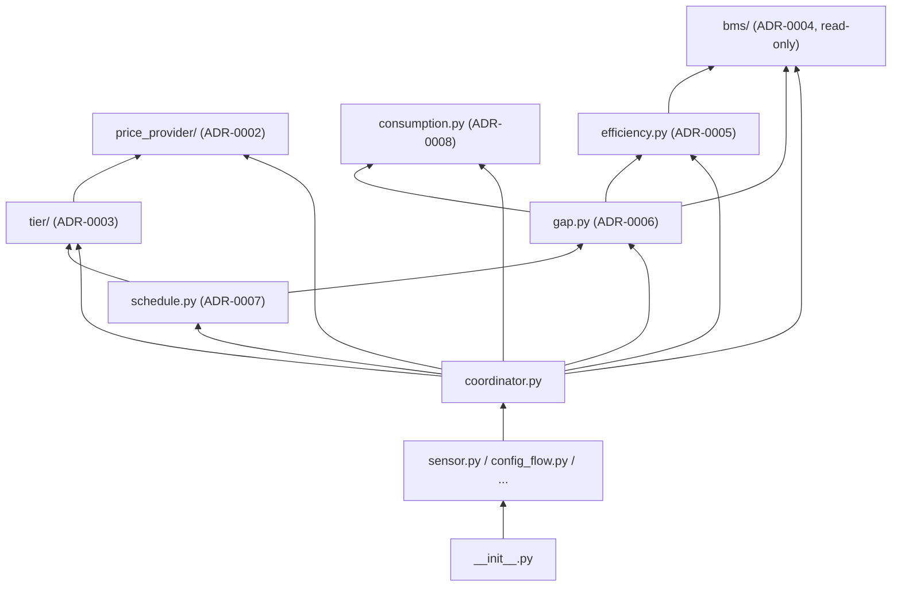

# ADR-0001 – Chargy Project Conventions: Identifiers, Module Layout, Version Targets

**Date:** 2026-09-20 **Status:** Draft

---

## Context

ADR-0000 defines project-independent engineering conventions using `<project>` /
`<Project>` placeholders and deliberately contains no concrete module diagram or
version numbers. This ADR is Chargy's companion document that fixes those
placeholders concretely, and is the single place where Chargy's own identifiers,
current (provisional) module layout, and version targets are recorded — so
ADR-0000 itself never needs editing when any of these change.

---

## Decision

### 1 — Project identifiers

- Package: `custom_components/chargy/`
- Entity-class prefix: `Chargy` — e.g. `ChargySensor`, `ChargyCoordinator`,
  `ChargyConfigFlow`, `ChargyOptionsFlow` (per ADR-0000 §5).
- Tooling invocation (per ADR-0000 §1):
  `mypy custom_components/chargy tests --config-file mypy.ini`.

### 2 — Minimum supported Python / Home Assistant version

Adopted from the sibling project Shady's current config: **Python ≥3.14**,
**Home Assistant ≥2026.3.1** (`pyproject.toml`'s `requires-python`,
`[tool.mypy] python_version`, and `hacs.json`'s `homeassistant` key all set
accordingly, per ADR-0000 §4). Taken as a reasonable starting point since Chargy
runs in the same environment as Shady, not independently re-derived — worth
revisiting if Chargy's actual deployment target ever diverges from Shady's.

### 3 — Module boundaries and dependency direction (provisional)

The concrete shape, based on the capabilities identified so far
(`adr/adr-capability.md`), before any of it has actually been built:

**This diagram is a planning sketch, not an implemented contract.** It must be
corrected by amendment once real modules exist and diverge from it — the same
discipline `adr/INDEX.md` enforces for ADR status changes (ADR-0000 §7) applies
here too.

### 4 — Current pure / zero-mocking test tier (ADR-0000 §6)

As of this draft, expected to comprise: `tier/`, `gap.py`, `schedule.py`,
`efficiency.py`, `consumption.py`, and the base classes in `price_provider/` and
`bms/`. The explicit `hass.states`-reading exceptions (ADR-0000 §3/§6) are the
concrete adapter implementations: `price_provider/tibber.py` and
`bms/solakon.py`.

---

## Consequences

- **Pro:** ADR-0000 stays copy-paste-clean for any future sibling project — only
  this document needs editing as Chargy's own layout evolves.
- **Pro:** Every other Chargy ADR can reference a single, current source for
  "what does the module layout look like right now" instead of each carrying its
  own stale sketch.
- **Con:** Two documents (ADR-0000 plus this one) must be read together to get
  the full picture of a single convention.
